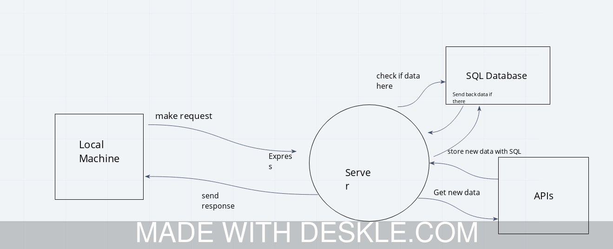

# City Explorer API

**Author**: Joshua Williams
**Version**: 1.0.0 (increment the patch/fix version number if you make more commits past your first submission)

## Overview
This app lets you put in a city name and get info about its location and weather.

## Getting Started
<!-- What are the steps that a user must take in order to build this app on their own machine and get it running? -->

## Architecture
This application is built with JavaScript, Node, Heroku, and has JSON data files. 

## Change Log
06-08-2020 4:17pm - Application now allows the user to enter the name of a city and get the weather and location of Lynnwood, WA.

06-09-2020 4:00pm - Application now brings in data from locations

06-09-2020 5:44pm - Application displays data for weather and trails

## Credits and Collaborations

Chance Harmon helped me create the ability to check the database to see if the search has already been done on a city.

### June 8

Number and name of feature: __Repository Set Up__

Estimate of time needed to complete: 30 minutes

Start time: 2:15pm

Finish time: 2:44pm

Actual time needed to complete: 29 minutes

Number and name of feature: __Locations__

Estimate of time needed to complete: 45 minutes

Start time: 2:45pm

Finish time: 3:15pm

Actual time needed to complete: 30 minutes

Number and name of feature: __Weather__

Estimate of time needed to complete: 30 minutes

Start time: 3:15pm

Finish time: 3:57pm

Actual time needed to complete: 42 minutes

Number and name of feature: __Errors__

Estimate of time needed to complete: 15 minutes

Start time: 3:57pm

Finish time: 4:12pm 

Actual time needed to complete: 15 minutes 

### June 9

Number and name of feature: __Data Formatting__

Estimate of time needed to complete: 15 minutes

Start time: 2:43pm

Finish time: 2:49pm

Actual time needed to complete: 6 minutes

Number and name of feature: __Locations__

Estimate of time needed to complete: 30 minutes

Start time: 2:50pm

Finish time: 3:59pm

Actual time needed to complete: 1 hour 19 minutes

Number and name of feature: __Weather__

Estimate of time needed to complete: 30 minutes

Start time: 3:59pm

Finish time: 4:47pm

Actual time needed to complete: 48 minutes

Number and name of feature: __Trails__

Estimate of time needed to complete: 30 minutes

Start time: 4:50pm

Finish time: 5:37pm

Actual time needed to complete: 47 minutes

### June 10

Number and name of feature: __Database__

Estimate of time needed to complete: 60 minutes

Start time: 3:03pm

Finish time: 3:45pm

Actual time needed to complete: 42 minutes

Number and name of feature: __Server__

Estimate of time needed to complete: 60 minutes

Start time: 3:46pm

Finish time: 6:14pm

Actual time needed to complete: 2 hours 28 minutes

Number and name of feature: __Deployment__

Estimate of time needed to complete: 30 minutes

Start time: 6:22pm

Finish time:

Actual time needed to complete:

### Sketches
Lab 07:

Lab 08:

